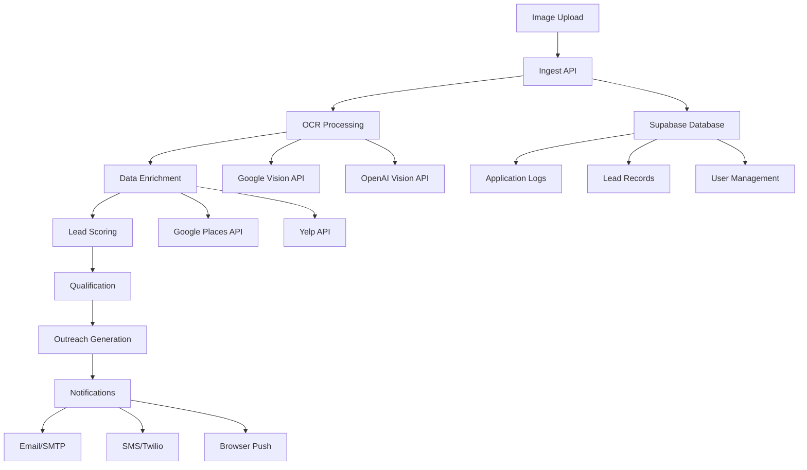

# Field Snap AI - MVP

**Transform photos of local business ads into qualified outbound leads with AI-powered automation.**

[](https://www.typescriptlang.org/)
[](https://bun.sh/)
[](https://supabase.com/)

## 🚀 Overview

Field Snap AI is a comprehensive lead processing system that automatically converts photos of business advertisements (truck wraps, storefront signs, business cards) into qualified sales leads. The system uses advanced OCR, data enrichment, intelligent scoring, and automated outreach generation.

### 🎯 Key Features

- **🖼️ Image Processing**: Advanced OCR with Google Vision API and OpenAI Vision fallback
- **🔍 Data Enrichment**: Automatic business information lookup using multiple APIs
- **📊 Intelligent Scoring**: Configurable lead qualification based on business attributes
- **📨 Enterprise Notifications**: Multi-channel alerts (email, SMS, browser, haptic)
- **🏢 Enterprise Logging**: Comprehensive audit trail with public API access
- **⚡ High Performance**: Built with Bun runtime for maximum speed
- **🔒 Type Safe**: Full TypeScript implementation with Zod validation
- **📱 Mobile First**: Responsive design optimized for mobile devices

## 🏗️ Architecture



## 🛠️ Tech Stack

### Core Runtime
- **[Bun](https://bun.sh/)** - Ultra-fast JavaScript runtime and package manager
- **[TypeScript](https://www.typescriptlang.org/)** - Type-safe JavaScript with modern features

### Database & Storage
- **[Supabase](https://supabase.com/)** - PostgreSQL database with real-time features
- **[Supabase Storage](https://supabase.com/storage)** - File storage for images and assets

### AI & OCR Services
- **[Google Cloud Vision API](https://cloud.google.com/vision)** - Primary OCR provider
- **[OpenAI Vision API](https://platform.openai.com/docs/guides/vision)** - Fallback OCR provider

### Communication
- **[Nodemailer](https://nodemailer.com/)** - Email delivery system
- **[Twilio](https://www.twilio.com/)** - SMS notifications
- **[Web Push](https://www.npmjs.com/package/web-push)** - Browser notifications

### Data Validation
- **[Zod](https://zod.dev/)** - TypeScript-first schema validation

## 📋 Prerequisites

- **Node.js** 18+ or **Bun** 1.0+
- **Supabase** project (free tier available)
- **Google Cloud** account with Vision API enabled
- **OpenAI** API key (fallback OCR)
- **Twilio** account (SMS notifications)
- **SMTP** server access (email notifications)

## 🚀 Quick Start

### 1. Clone and Install

```bash
git clone https://github.com/Swimhack/Field-Snap-AI.git
cd Field-Snap-AI
bun install
```

### 2. Environment Setup

```bash
cp infra/env.example .env
# Edit .env with your configuration
```

### 3. Database Setup

1. Create a new [Supabase project](https://app.supabase.com/)
2. Copy the database schema:
   ```bash
   # Copy the contents of infra/supabase.sql
   # Paste into Supabase SQL Editor and run
   ```

### 4. Configure Services

#### Google Cloud Vision API
1. Create a [Google Cloud Project](https://console.cloud.google.com/)
2. Enable the Vision API
3. Create a service account and download the JSON key
4. Add credentials to your `.env` file

#### OpenAI API (Fallback)
1. Get your API key from [OpenAI Platform](https://platform.openai.com/)
2. Add to `.env`: `OPENAI_API_KEY=your-key-here`

#### Twilio (SMS)
1. Create a [Twilio account](https://www.twilio.com/)
2. Get your Account SID, Auth Token, and phone number
3. Add to `.env`

### 5. Run the Application

```bash
# Development mode with hot reload
bun run dev

# Production mode
bun run start

# Type checking
bun run type-check
```

The API will be available at `http://localhost:3001`

## 📱 Mobile App Development

For mobile app development, we've prepared the structure for **Android Studio** manual build and deployment:

### Android Setup
```bash
# Create Android project structure
mkdir -p mobile/android/app/src/main/java/com/fieldsnap/ai
mkdir -p mobile/android/app/src/main/res

# Copy base Android configuration
# (Implementation files would be added here)
```

### Best Practices
- **Mobile-first design** with `viewport=1`
- **SEO optimized** meta tags and structure
- **Progressive Web App** capabilities
- **Offline support** for core functionality

## 🔧 API Usage

### Basic Image Processing

```bash
curl -X POST http://localhost:3001 \
  -H "Content-Type: application/json" \
  -d '{
    "imageUrl": "https://example.com/business-photo.jpg",
    "sourceLocation": "Main Street, Downtown",
    "sourceNotes": "Truck wrap photo"
  }'
```

### Response Format

```json
{
  "success": true,
  "leadId": "uuid-here",
  "message": "Lead processing completed successfully. Lead qualified with score 75.",
  "processingId": "req_1234567890_abc123"
}
```

## 📊 Application Logs

### Public Log Access
The application provides a **secure public API** for log access, perfect for AI agent integration:

```bash
# Get recent logs (public view)
curl http://localhost:3001/api/logs

# Filter by component
curl http://localhost:3001/api/logs?component=ocr&level=error
```

### Log Levels
- `debug` - Detailed debugging information
- `info` - General information messages
- `warn` - Warning messages
- `error` - Error conditions
- `fatal` - Critical errors

## 🔔 Enterprise Notification System

### Multi-Channel Support
- **📧 Email**: Rich HTML templates with lead details
- **📱 SMS**: Concise text alerts for urgent notifications
- **🌐 Browser**: Real-time push notifications
- **📳 Haptic**: Mobile device vibration alerts
- **🔊 Sound**: Audio alerts for desktop users

### User Preferences
Users can configure notification preferences per channel:

```json
{
  "email": {
    "enabled": true,
    "types": ["lead_qualified", "system_alerts", "daily_summary"]
  },
  "sms": {
    "enabled": false,
    "types": ["urgent_alerts"],
    "phone": "+1234567890"
  },
  "browser": {
    "enabled": true,
    "types": ["lead_qualified", "processing_complete"]
  }
}
```

## 📈 Lead Scoring System

### Default Scoring Rules
```json
{
  "phone_number": 25,
  "email": 20,
  "website": 15,
  "social_media": 10,
  "business_hours": 5,
  "reviews_count": 15,
  "reviews_rating": 10
}
```

### Qualification Thresholds
- **Qualified**: 50+ points
- **High Priority**: 80+ points
- **Automatic Outreach**: 70+ points (configurable)

## 🏢 Web Application Options

### Option 1: Vanilla Stack (Recommended for Simple Use)
- **HTML5** with semantic markup
- **CSS3** with modern features and mobile-first responsive design
- **Vanilla JavaScript** for interactivity
- **PHP** backend for server-side processing
- **SEO optimized** with proper meta tags and structured data

### Option 2: Next.js (Recommended for Complex Features)
- **React/Next.js** for robust component architecture
- **Server-side rendering** for optimal performance
- **API routes** for backend functionality
- **Automatic optimization** for production builds

## 🛡️ Security Features

- **Row Level Security** (RLS) policies in Supabase
- **API key validation** for all external services
- **Input sanitization** with Zod schemas
- **Rate limiting** to prevent abuse
- **CORS configuration** for secure API access
- **Environment variable protection**

## 📊 Monitoring & Analytics

### Health Checks
```bash
# Database connection
curl http://localhost:3001/health/db

# OCR providers status
curl http://localhost:3001/health/ocr

# Notification system
curl http://localhost:3001/health/notifications
```

### Performance Metrics
- Processing time per pipeline stage
- OCR accuracy and confidence scores
- Lead qualification rates
- Notification delivery success rates

## 🚀 Deployment Options

### ✨ Quick Deploy to Fly.io (Recommended)

Deploy to **snap.fly.dev** in under 5 minutes:

```bash
# 1. Install Fly CLI
curl -L https://fly.io/install.sh | sh

# 2. Authenticate
fly auth login

# 3. Deploy with our script
./scripts/deploy.sh
```

**Live Demo**: https://snap.fly.dev

### Other Deployment Options

#### Serverless Functions
- **Netlify Functions**
- **Vercel Functions**
- **Supabase Edge Functions**
- **AWS Lambda**

#### Traditional Hosting
- **DigitalOcean Droplets**
- **Railway**
- **Render**
- **Heroku**

#### Container Deployment
```dockerfile
FROM oven/bun:1
WORKDIR /app
COPY package.json bun.lockb ./
RUN bun install
COPY . .
EXPOSE 8080
CMD ["bun", "run", "start"]
```

For detailed deployment instructions, see [deploy.md](./deploy.md).

## 🧪 Testing

```bash
# Run all tests
bun test

# Test OCR providers
bun test src/providers/ocr.test.ts

# Test database operations
bun test src/providers/db.test.ts

# Test the complete pipeline
bun test functions/ingest.test.ts
```

## 📚 Project Structure

```
Field-Snap-AI/
├── functions/
│   └── ingest.ts              # Main HTTP entry point
├── infra/
│   ├── supabase.sql          # Database schema
│   └── env.example           # Environment variables template
├── src/
│   ├── core/
│   │   └── types.ts          # Zod schemas and TypeScript types
│   ├── providers/
│   │   ├── db.ts             # Supabase database client
│   │   ├── ocr.ts            # OCR provider with factory pattern
│   │   ├── storage.ts        # File storage operations
│   │   ├── enrich.ts         # Business data enrichment
│   │   ├── scoring.ts        # Lead scoring and qualification
│   │   └── notifications.ts  # Multi-channel notification system
│   └── utils/
│       └── logger.ts         # Application logging
├── mobile/                   # Mobile app structure (Android Studio ready)
├── package.json
├── tsconfig.json
├── .gitignore
└── README.md
```

## 🤝 Contributing

1. Fork the repository
2. Create a feature branch: `git checkout -b feature/new-feature`
3. Commit changes: `git commit -am 'Add new feature'`
4. Push to branch: `git push origin feature/new-feature`
5. Submit a Pull Request

### Development Guidelines
- Follow TypeScript best practices
- Write tests for new features
- Update documentation for API changes
- Ensure mobile-responsive design
- Maintain SEO optimization

## 📄 License

This project is licensed under the MIT License. See the [LICENSE](LICENSE) file for details.

## 🆘 Support

- **Documentation**: [Wiki](https://github.com/Swimhack/Field-Snap-AI/wiki)
- **Issues**: [GitHub Issues](https://github.com/Swimhack/Field-Snap-AI/issues)
- **Discussions**: [GitHub Discussions](https://github.com/Swimhack/Field-Snap-AI/discussions)

## 🎯 Roadmap

### Phase 1 (Current) - MVP
- [x] Basic OCR processing
- [x] Lead scoring system
- [x] Notification system
- [x] Database schema
- [x] API endpoint

### Phase 2 - Enhanced Features
- [ ] Advanced business enrichment
- [ ] Machine learning-based scoring
- [ ] Automated outreach campaigns
- [ ] Web dashboard
- [ ] Mobile app

### Phase 3 - Enterprise Features
- [ ] Multi-tenant support
- [ ] Advanced analytics
- [ ] CRM integrations
- [ ] White-label solutions
- [ ] API marketplace

---

**Field Snap AI** - Turning every business photo into a qualified lead opportunity. 📸➡️💼
